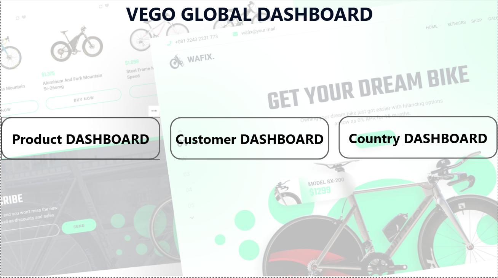
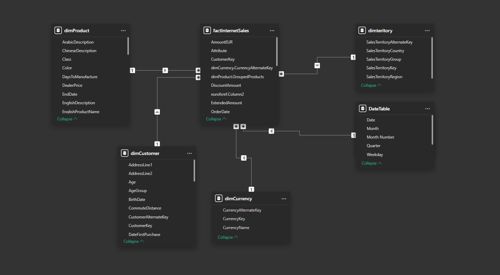
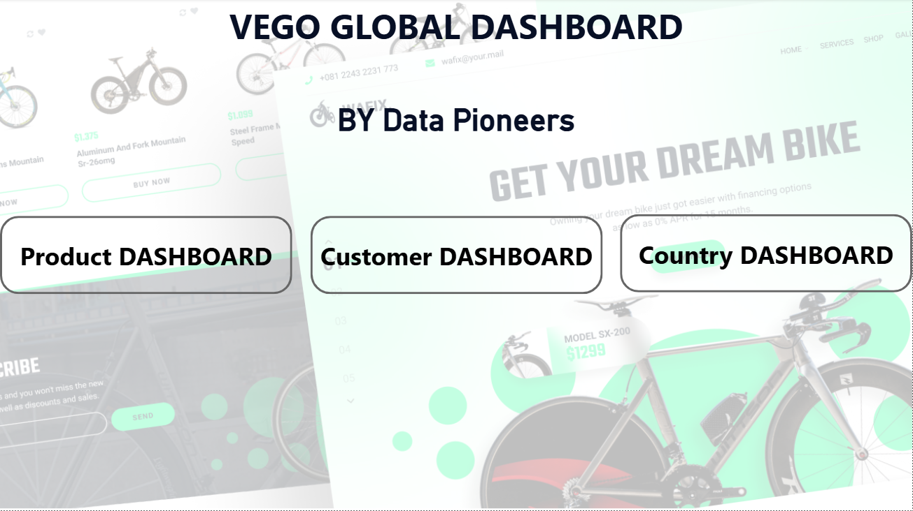
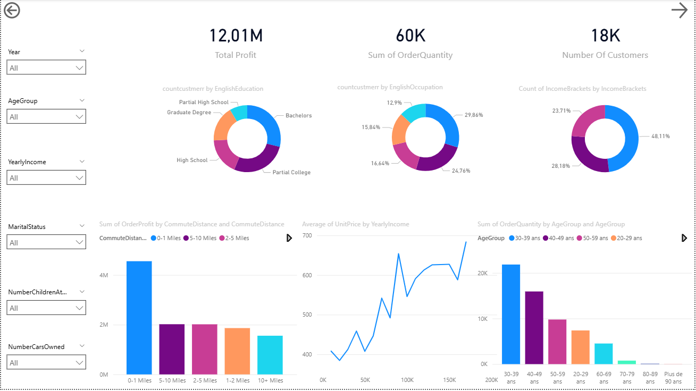
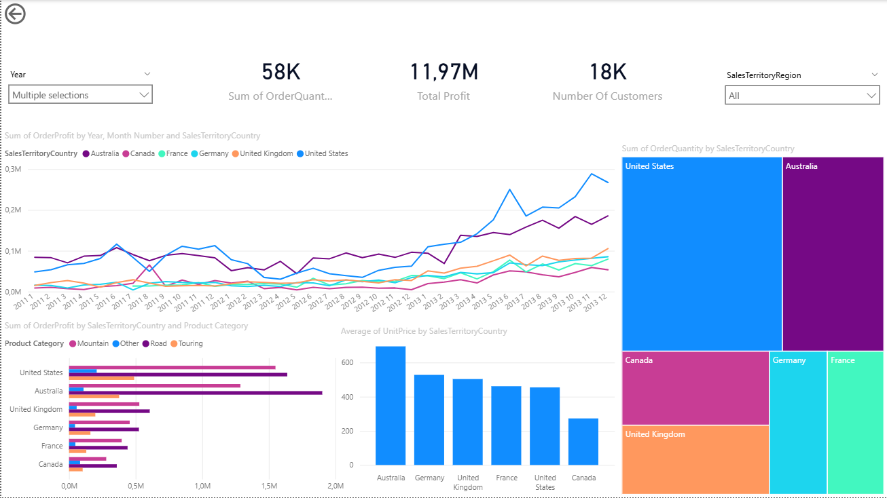

# Vego Global E-Commerce Power BI Dashboard

An interactive Power BI dashboard designed for **Vego Global** (by Data Pioneers) to track, analyze, and visualize e-commerce sales performance. This project breaks down complex sales data into actionable insights across products, customers, and geographic regions.

## 📊 Project Overview
The primary objective of this dashboard is to provide a comprehensive view of Vego Global's bicycle and accessory sales. It features a custom navigation experience and divides key metrics into three distinct analytical areas: **Products**, **Customers**, and **Countries**.

## 🗄️ Data Model
The project utilizes a robust **Star Schema** data model to ensure efficient querying and dynamic cross-filtering across all reports. 

*   **Fact Table:** `factInternetSales` (Central table containing transactional data, order quantities, and profit metrics).
*   **Dimension Tables:** 
    *   `dimProduct` (Product details, categories, and descriptions)
    *   `dimCustomer` (Demographics, income, and geographic data)
    *   `dimteritory` (Sales regions and countries)
    *   `dimCurrency` (Currency conversion details)
    *   `DateTable` (Time intelligence for year-over-year and monthly trending)

---

## 📈 Dashboard Features & Pages

### 1. Product Dashboard
Focuses on inventory performance, profitability by model, and trending product categories.

*   **Key KPIs:** Minimum Unit Price, Total Profit (12.01M), and Total Orders (60K).
*   **Trend Analysis:** A chronological view of total profit by year and month.
*   **Product Breakdown:** Visualizes profit and order quantities across grouped products (Road, Mountain, Touring, and Helmets) and specific model names.

### 2. Customer Dashboard
Analyzes the demographic profile of the 18K+ customer base to understand purchasing behaviors.

*   **Demographic Slicers:** Users can filter by Age Group, Yearly Income, Marital Status, Children at Home, and Cars Owned.
*   **Customer Segmentation:** Donut charts breaking down customers by Education, Occupation, and Income Brackets.
*   **Behavioral Insights:** Charts correlating Commute Distance to Order Profit, and Average Unit Price to Yearly Income. 

### 3. Country Dashboard
Provides a geographic breakdown of global sales performance and regional profitability.

*   **Global Reach:** Analyzes metrics across the United States, Australia, United Kingdom, Germany, France, and Canada.
*   **Regional Trends:** Line charts comparing total profit over time for each specific sales territory.
*   **Volume vs. Value:** A treemap displaying the sum of order quantities by country, paired with bar charts detailing profit by country and product category.

---

## 🚀 How to Use This Dashboard
1. Download the `.pbix` file from this repository.
2. Open the file using **Power BI Desktop**.
3. Use the **Landing Page** buttons to navigate between the Product, Customer, and Country views.
4. Interact with the dropdown slicers on the left side of each page to filter the data by year, demographic, or product group.
